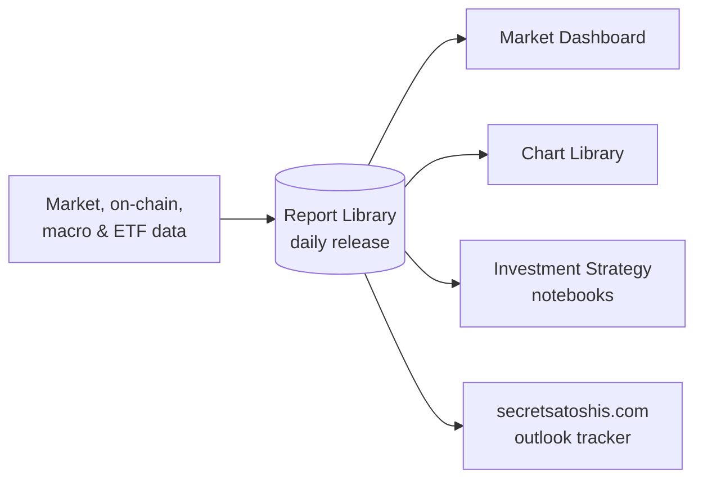

# Secret Satoshis

**Bitcoin intelligence you can verify.**

Bitcoin market analysis and open data, built on more than a decade inside Bitcoin markets.
These repositories hold the data and code behind the Secret Satoshis dashboard, charts and
research, so anyone can inspect, rerun or reuse them.

- **Start here:** [secretsatoshis.com](https://secretsatoshis.com/)
- **Read the newsletter:** [newsletter.secretsatoshis.com](https://newsletter.secretsatoshis.com/)

## Where the work is published

| Site | What's there |
|------|--------------|
| **[secretsatoshis.com](https://secretsatoshis.com/)** | The platform, and the year's Bitcoin price outlook tracked against the latest close |
| **[Market Dashboard](https://dashboard.secretsatoshis.com/)** | Current Bitcoin market data, valuation models, on-chain conditions and cycle context, updated daily |
| **[Chart Library](https://charts.secretsatoshis.com/)** | 54 interactive charts covering price, ETF flows, on-chain activity, supply, mining and valuation |
| **[Newsletter](https://newsletter.secretsatoshis.com/)** | Weekly recaps, quarterly strategy reviews and the annual Bitcoin price outlook |
| **[Agent 21](https://chatgpt.com/g/g-BZXtVdU6M-agent-21)** | An AI agent for exploring Secret Satoshis research and live Bitcoin data |

## How it fits together

Everything starts from one daily data release. The Report Library collects the data, checks
it, and publishes it with a manifest that records the report date and each file's SHA-256
hash. The dashboard, charts, notebooks and homepage tracker all read that same release, so
their numbers agree, and anyone can check them against the
[manifest](https://secretsatoshis.github.io/Bitcoin-Report-Library/csv/release_manifest.json).

## Public repositories

| Repository | What it does |
|------------|--------------|
| **[Bitcoin-Report-Library](https://github.com/SecretSatoshis/Bitcoin-Report-Library)** | Collects and checks the data, publishes the daily release, and hosts the Market Dashboard |
| **[Bitcoin-Chart-Library](https://github.com/SecretSatoshis/Bitcoin-Chart-Library)** | Chart definitions, and the site that builds them from the release |
| **[Bitcoin-Investment-Strategy](https://github.com/SecretSatoshis/Bitcoin-Investment-Strategy)** | A savings plan run against real price history, companion to [*Should I buy bitcoin?*](https://newsletter.secretsatoshis.com/p/should-i-buy-bitcoin), and two studies of Bitcoin's supply and demand |
| **[Secret-Satoshis-Website](https://github.com/SecretSatoshis/Secret-Satoshis-Website)** | The secretsatoshis.com home page and its outlook tracker |
| **[Trey-Brunson-Website](https://github.com/SecretSatoshis/Trey-Brunson-Website)** | Trey Brunson's personal site, treybrunson.com |

## License

Research, not investment advice. Code and original content are released under GPL-3.0;
each repository's `LICENSE` sets its scope, and third-party data keeps its publishers' terms.

Created by [Trey Brunson](https://treybrunson.com/).

---

**Don't trust. Verify.**
